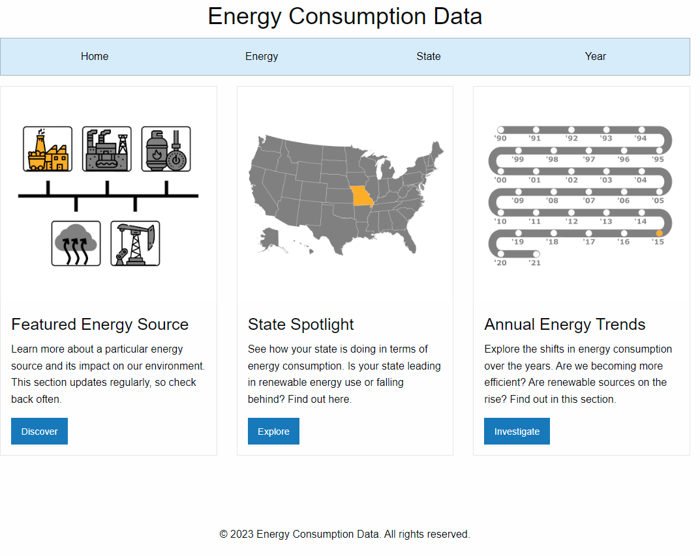

Energy Consumption Data
=======================

Energy Consumption Data is a web application that displays energy consumption data for the United States. It provides detailed information on the consumption of various energy sources such as Coal, Geothermal, Natural Gas, Other Gases, and Petroleum. The application is built using HTML, CSS, Foundation, JavaScript, Node.js, Chart.js, Express, and SQLite3 and allows users to explore energy consumption data by energy type, state, and year.

Table of Contents
-----------------
- [Features](#features)
- [Requirements](#requirements)
- [Running the Application Locally](#running-the-application-locally)
- [Code Structure](#code-structure)
- [Contributing](#contributing)
- [License](#license)

Features
--------
- Display energy consumption data by energy type, state, and year
- Dynamic data presentation using Chart.js
- Easy navigation between energy types, states, and years
- Foundation framework for responsive design to provide better user experience on different devices
- SQLite3 database for efficient data storage and retrieval

Requirements
------------
To run the application locally, you'll need the following software:
- Node.js
- npm (Node Package Manager)
- A modern web browser (Google Chrome, Mozilla Firefox, Microsoft Edge, etc.)
- A code editor (Visual Studio Code, Atom, Sublime Text, etc.)

Running the Application Locally
-------------------------------
1. Start by cloning the repository to your local machine:
```
git clone https://github.com/osxzxso/energy-consumption.git
```
Alternatively, you can download the repository as a ZIP file and extract it to a desired location.

2. Navigate to the project folder and install the required dependencies using npm:
```
cd energy-consumption
```
```
npm i
```
3. Start the application by running the following command:
```
node server.js
```
4. Open your web browser and navigate to http://localhost:8000 to start exploring the energy consumption data.

Code Structure
--------------
The code is organized in the following structure:

- `server.js`: Contains the main server logic, database connection, and routing.
- `public`: Contains the static files such as images, CSS, and JavaScript.
- `templates`: Contains the HTML templates for each page (index.html, energy.html, state.html, and year.html).
- `db`: Contains the SQLite3 database file (ec.db).

Contributing
------------
Contributions are welcome! If you'd like to contribute, please follow these steps:

1. Fork the repository.
2. Clone your forked repository to make changes.
3. Create a new branch for your feature or bug fix.
4. Commit your changes and push them to your fork.
5. Create a pull request to the original repository.

Please make sure your code follows best coding practices and include any necessary documentation.

License
-------
Energy Consumption Data is licensed under the MIT License. You are free to use, modify, and distribute this code, as long as attribution is provided and you include the license notice and follow its terms and conditions.
